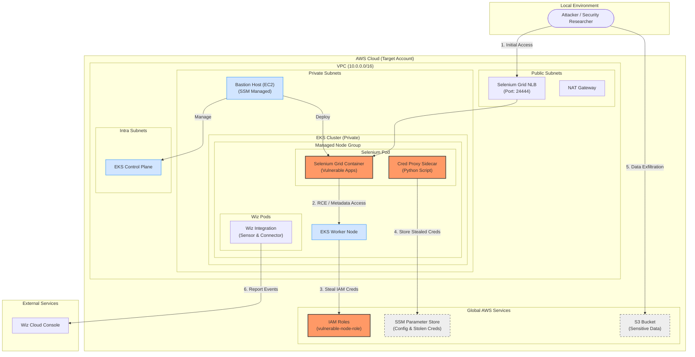

# Wiz Defend Attack Simulation Terraform Module for AWS

This project provides infrastructure and tooling to simulate a controlled attack scenario in Amazon Web Services (AWS). The simulation demonstrates a privilege escalation and data exfiltration attack path, helping organizations understand potential security risks in a safe, controlled environment.

# Attack Scenario

The simulation demonstrates the following attack flow:

- Initial access via a Selenium Grid Server misconfigured and exposed to public internet **(Event origin: Wiz Sensor)**
- Remote Code Execution allowing the attacker to retrieve EC2 Instance metadata **(Event origin: Wiz Sensor)**
- Usage of EC2 Instance Role to enumerate AWS IAM, RDS API and do S3 ls **(Event origin: AWS CloudTrail)**
- Exfiltration of sensitive data from an S3 bucket **(Event origin: S3 Data Events)**

# Prerequisites

- **Terraform** >= 1.5.0
- **Python** >= 3.7
- **AWS CLI** installed and configured
- **Wiz Service Account** with `read:service_accounts` and `write:service_accounts` permissions
- **Wiz Sensor Pull Credentials** (Username/Password)

---

# 🚀 Deployment Guide (Two-Stage Approach)

The simulation uses a **private EKS cluster** for maximum security. This requires a **two-stage deployment**:

1. **Stage 1**: Deploy all AWS Infrastructure (VPC, Bastion, S3, and EKS Cluster) from your laptop.
2. **Stage 2**: Deploy internal Kubernetes resources (Wiz integration, Selenium) from the Bastion host.

## Stage 1: Deploy AWS Infrastructure (From Your Laptop)

### Step 1: Configure terraform.tfvars

Create `terraform.tfvars` with Stage 1 configuration:

```hcl
# Required
aws_region = "us-east-1"
allowed_cidr_blocks = ["YOUR.IP.ADDRESS/32"]  # Your IP for accessing Selenium Grid

# Deployment ID - MUST be consistent
deployment_id = "main"

# Wiz Configuration (used in Stage 2, but configured here)
wiz_k8s_integration_client_endpoint = "prod"
wiz_sensor_pull_username            = "your-wiz-username"
wiz_sensor_pull_password            = "your-wiz-password"

# Stage 1 Deployment
deployment_stage = "stage1"
create_bastion_host = true

# EKS Configuration (private)
cluster_endpoint_public_access = false
cluster_endpoint_private_access = true
```

### Step 2: Deploy Stage 1

```bash
terraform init
terraform apply
```

**What gets created:** VPC, Bastion Host, S3 Bucket, and the **EKS Cluster** (Control Plane & Worker Nodes).

### Step 3: Package and Upload files to S3

Upload the module to S3 so the bastion can access it:

```bash
# Package files (explicitly excluding any local state)
tar --exclude='*.tfstate*' -czf terraform-files.tar.gz *.tf *.py requirements.txt scripts/ data/ terraform.tfvars

# Get bucket name and upload
BUCKET_NAME=$(terraform output -raw bucket_name)
aws s3 cp terraform-files.tar.gz s3://${BUCKET_NAME}/stage2/
```

---

## Stage 2: Deploy Kubernetes Resources (From Bastion)

### Step 1: Connect to Bastion

```bash
# Get bastion instance ID
BASTION_ID=$(terraform output -raw bastion_instance_id)

# Connect via AWS Session Manager
aws ssm start-session --target $BASTION_ID

# Switch to ec2-user
sudo su - ec2-user
```

### Step 2: Download and Extract Files

```bash
# Run the helper script (pre-installed on bastion)
./download_terraform.sh

# Install dependencies
pip3 install -r requirements.txt
```

### Step 3: Update terraform.tfvars for Stage 2

On the bastion, edit `terraform.tfvars`:

```hcl
deployment_id = "main"        # Must match Stage 1
deployment_stage = "stage2"   # Change to stage2
create_bastion_host = false    # Keep as false
```

### Step 4: Deploy Stage 2

```bash
export WIZ_CLIENT_ID="your-client-id"
export WIZ_CLIENT_SECRET="your-client-secret"

terraform init
terraform apply
```

**Note**: This installs the Wiz Integration and Selenium Grid inside the private cluster. Use `/home/ec2-user/setup_stage2.sh` if you need manual `kubectl` access from the bastion.

---

# 🕹️ Running Attack Simulation

The attack simulation works from any environment (including the bastion) by fetching target details from SSM Parameter Store.

Execute the script after Stage 2 deployment:

```sh
AWS_REGION="us-east-1" python3 ./simulate_attack.py
```

Optional flags:

- `--run-nmap` - Run an nmap scan on the target
- `--enable-listener` - Enable reverse shell listener (may fail due to firewalls)

---

# 🔍 Detection Points

This simulation triggers the following Wiz detections:

- **Reverse Shell Detection**: Python-based reverse shell patterns
- **Remote Code Execution**: Unauthorized code execution in Selenium
- **Credential Theft**: EC2 instance credentials accessed via metadata
- **External Credential Use**: Credentials used from outside AWS
- **Data Exfiltration**: S3 data downloaded using stolen credentials

# 🧹 Cleanup

To destroy all resources:

```sh
# On bastion (Stage 2)
terraform destroy

# Then from laptop (Stage 1)
terraform destroy
```

<!-- BEGIN_TF_DOCS -->

## Requirements

| Name                                                                     | Version |
| ------------------------------------------------------------------------ | ------- |
| <a name="requirement_terraform"></a> [terraform](#requirement_terraform) | ~> 1.6  |
| <a name="requirement_kubectl"></a> [kubectl](#requirement_kubectl)       | ~> 2.0  |
| <a name="requirement_wiz"></a> [wiz](#requirement_wiz)                   | ~> 1.8  |

## Providers

| Name                                                                                                                                          | Version |
| --------------------------------------------------------------------------------------------------------------------------------------------- | ------- |
| <a name="provider_aws"></a> [aws](#provider_aws)                                                                                              | n/a     |
| <a name="provider_helm.simu_kubernetes_cluster"></a> [helm.simu_kubernetes_cluster](#provider_helm.simu_kubernetes_cluster)                   | n/a     |
| <a name="provider_kubectl.simu_kubernetes_cluster"></a> [kubectl.simu_kubernetes_cluster](#provider_kubectl.simu_kubernetes_cluster)          | ~> 2.0  |
| <a name="provider_kubernetes.simu_kubernetes_cluster"></a> [kubernetes.simu_kubernetes_cluster](#provider_kubernetes.simu_kubernetes_cluster) | n/a     |
| <a name="provider_random"></a> [random](#provider_random)                                                                                     | n/a     |
| <a name="provider_time"></a> [time](#provider_time)                                                                                           | n/a     |

## Modules

| Name                                                                                                     | Source                        | Version |
| -------------------------------------------------------------------------------------------------------- | ----------------------------- | ------- |
| <a name="module_simu_kubernetes_cluster"></a> [simu_kubernetes_cluster](#module_simu_kubernetes_cluster) | terraform-aws-modules/eks/aws | ~> 20.0 |
| <a name="module_vpc"></a> [vpc](#module_vpc)                                                             | terraform-aws-modules/vpc/aws | ~> 5.0  |

## Resources

| Name                                                                                                                                                                          | Type        |
| ----------------------------------------------------------------------------------------------------------------------------------------------------------------------------- | ----------- |
| [aws_iam_role.selenium-exporter](https://registry.terraform.io/providers/hashicorp/aws/latest/docs/resources/iam_role)                                                        | resource    |
| [aws_iam_role_policy_attachment.selenium-exporter_policy_attachment](https://registry.terraform.io/providers/hashicorp/aws/latest/docs/resources/iam_role_policy_attachment)  | resource    |
| [aws_s3_bucket.creating_bucket_sensitive_data](https://registry.terraform.io/providers/hashicorp/aws/latest/docs/resources/s3_bucket)                                         | resource    |
| [aws_s3_bucket_public_access_block.creating_bucket_sensitive_data](https://registry.terraform.io/providers/hashicorp/aws/latest/docs/resources/s3_bucket_public_access_block) | resource    |
| [aws_s3_object.creating_bucket_sensitive_data](https://registry.terraform.io/providers/hashicorp/aws/latest/docs/resources/s3_object)                                         | resource    |
| [helm_release.wiz_K8s_integration](https://registry.terraform.io/providers/hashicorp/helm/latest/docs/resources/release)                                                      | resource    |
| [kubectl_manifest.selenium_deployment](https://registry.terraform.io/providers/alekc/kubectl/latest/docs/resources/manifest)                                                  | resource    |
| [kubectl_manifest.selenium_service](https://registry.terraform.io/providers/alekc/kubectl/latest/docs/resources/manifest)                                                     | resource    |
| [kubernetes_namespace.wiz](https://registry.terraform.io/providers/hashicorp/kubernetes/latest/docs/resources/namespace)                                                      | resource    |
| [random_id.unique_id](https://registry.terraform.io/providers/hashicorp/random/latest/docs/resources/id)                                                                      | resource    |
| [time_sleep.eks_wait](https://registry.terraform.io/providers/hashicorp/time/latest/docs/resources/sleep)                                                                     | resource    |
| [time_sleep.selenium_wait](https://registry.terraform.io/providers/hashicorp/time/latest/docs/resources/sleep)                                                                | resource    |
| [aws_ami.ubuntu](https://registry.terraform.io/providers/hashicorp/aws/latest/docs/data-sources/ami)                                                                          | data source |
| [aws_availability_zones.available](https://registry.terraform.io/providers/hashicorp/aws/latest/docs/data-sources/availability_zones)                                         | data source |
| [aws_caller_identity.current](https://registry.terraform.io/providers/hashicorp/aws/latest/docs/data-sources/caller_identity)                                                 | data source |
| [aws_eks_cluster_auth.eks_cluster](https://registry.terraform.io/providers/hashicorp/aws/latest/docs/data-sources/eks_cluster_auth)                                           | data source |
| [aws_iam_session_context.current](https://registry.terraform.io/providers/hashicorp/aws/latest/docs/data-sources/iam_session_context)                                         | data source |
| [aws_partition.current](https://registry.terraform.io/providers/hashicorp/aws/latest/docs/data-sources/partition)                                                             | data source |
| [kubernetes_service.selenium](https://registry.terraform.io/providers/hashicorp/kubernetes/latest/docs/data-sources/service)                                                  | data source |

## Inputs

| Name                                                                                                                                                | Description                                                                                          | Type           | Default                                                                  | Required |
| --------------------------------------------------------------------------------------------------------------------------------------------------- | ---------------------------------------------------------------------------------------------------- | -------------- | ------------------------------------------------------------------------ | :------: |
| <a name="input_access_entries"></a> [access_entries](#input_access_entries)                                                                         | A map representing access entries to add to the EKS cluster.                                         | `any`          | `{}`                                                                     |    no    |
| <a name="input_aws_region"></a> [aws_region](#input_aws_region)                                                                                     | The AWS region in which to create resources.                                                         | `string`       | `"us-east-1"`                                                            |    no    |
| <a name="input_cluster_admins"></a> [cluster_admins](#input_cluster_admins)                                                                         | A list containing the ARNs of users/roles that should be cluster administrators.                     | `list(string)` | `[]`                                                                     |    no    |
| <a name="input_cluster_create_wait"></a> [cluster_create_wait](#input_cluster_create_wait)                                                          | A string representing the time to wait after creating the EKS cluster before provisioning resources. | `string`       | `"60s"`                                                                  |    no    |
| <a name="input_cluster_version"></a> [cluster_version](#input_cluster_version)                                                                      | The kubernetes version for the EKS cluster.                                                          | `string`       | `"1.29"`                                                                 |    no    |
| <a name="input_create_iam_role"></a> [create_iam_role](#input_create_iam_role)                                                                      | A boolean representing whether to create an IAM role for the EKS node group.                         | `bool`         | `false`                                                                  |    no    |
| <a name="input_eks_node_group_role_arn"></a> [eks_node_group_role_arn](#input_eks_node_group_role_arn)                                              | The ARN of the IAM role to associate with the EKS node group.                                        | `string`       | `""`                                                                     |    no    |
| <a name="input_enable_flow_log"></a> [enable_flow_log](#input_enable_flow_log)                                                                      | A boolean representing whether to enable flow logs for the VPC.                                      | `bool`         | `false`                                                                  |    no    |
| <a name="input_environment"></a> [environment](#input_environment)                                                                                  | A string representing the prefix for all created resources.                                          | `string`       | `"demo"`                                                                 |    no    |
| <a name="input_flow_log_destination_arn"></a> [flow_log_destination_arn](#input_flow_log_destination_arn)                                           | The ARN of the destination for the flow logs.                                                        | `string`       | `null`                                                                   |    no    |
| <a name="input_flow_log_destination_type"></a> [flow_log_destination_type](#input_flow_log_destination_type)                                        | A string representing the destination type for the flow logs.                                        | `string`       | `null`                                                                   |    no    |
| <a name="input_metadata_options"></a> [metadata_options](#input_metadata_options)                                                                   | A map representing the metadata options for the EKS node group.                                      | `map(string)`  | `{}`                                                                     |    no    |
| <a name="input_prefix"></a> [prefix](#input_prefix)                                                                                                 | A string representing the prefix for all created resources.                                          | `string`       | `"wiz-attack-simulation"`                                                |    no    |
| <a name="input_selenium_wait"></a> [selenium_wait](#input_selenium_wait)                                                                            | A string representing the time to wait after creating the Selenium Service.                          | `string`       | `"60s"`                                                                  |    no    |
| <a name="input_tags"></a> [tags](#input_tags)                                                                                                       | A map/dictionary of Tags to be assigned to created resources.                                        | `map(string)`  | <pre>{<br> "owner": "Wiz",<br> "project": "Attack Simulation"<br>}</pre> |    no    |
| <a name="input_use_wiz_admission_controller"></a> [use_wiz_admission_controller](#input_use_wiz_admission_controller)                               | A boolean representing whether or not to deploy the Wiz Admission Controller in the EKS cluster.     | `bool`         | `false`                                                                  |    no    |
| <a name="input_use_wiz_admission_controller_audit_log"></a> [use_wiz_admission_controller_audit_log](#input_use_wiz_admission_controller_audit_log) | A boolean representing whether or not to use Wiz Admission Controller to gather EKS Logs.            | `bool`         | `false`                                                                  |    no    |
| <a name="input_use_wiz_sensor"></a> [use_wiz_sensor](#input_use_wiz_sensor)                                                                         | A boolean representing whether or not to deploy the Wiz Sensor in the EKS cluster.                   | `bool`         | `false`                                                                  |    no    |
| <a name="input_vpc_cidr"></a> [vpc_cidr](#input_vpc_cidr)                                                                                           | The CIDR subnet address for the created VPC.                                                         | `string`       | `"10.0.0.0/16"`                                                          |    no    |
| <a name="input_vpc_name"></a> [vpc_name](#input_vpc_name)                                                                                           | A string representing a user specified name for the created VPC.                                     | `string`       | `""`                                                                     |    no    |
| <a name="input_vpc_subnets"></a> [vpc_subnets](#input_vpc_subnets)                                                                                  | The number of subnets to configure for the created VPC.                                              | `string`       | `2`                                                                      |    no    |
| <a name="input_wiz_admission_controller_mode"></a> [wiz_admission_controller_mode](#input_wiz_admission_controller_mode)                            | A string representing the mode in which the Wiz Admission Controller should operate.                 | `string`       | `"AUDIT"`                                                                |    no    |
| <a name="input_wiz_admission_controller_policies"></a> [wiz_admission_controller_policies](#input_wiz_admission_controller_policies)                | A list of strings representing the Wiz Admission Controller policies that should be enforced.        | `list(string)` | `[]`                                                                     |    no    |
| <a name="input_wiz_k8s_integration_client_endpoint"></a> [wiz_k8s_integration_client_endpoint](#input_wiz_k8s_integration_client_endpoint)          | A string representing the Client Endpoint for the Wiz Sensor service account.                        | `string`       | `""`                                                                     |    no    |
| <a name="input_wiz_k8s_integration_client_id"></a> [wiz_k8s_integration_client_id](#input_wiz_k8s_integration_client_id)                            | A string representing the Client ID for the Wiz Sensor service account.                              | `string`       | `""`                                                                     |    no    |
| <a name="input_wiz_k8s_integration_client_secret"></a> [wiz_k8s_integration_client_secret](#input_wiz_k8s_integration_client_secret)                | A string representing the Client Secret for the Wiz Sensor service account.                          | `string`       | `""`                                                                     |    no    |
| <a name="input_wiz_sensor_pull_password"></a> [wiz_sensor_pull_password](#input_wiz_sensor_pull_password)                                           | A string representing the image pull password for Wiz container images.                              | `string`       | `""`                                                                     |    no    |
| <a name="input_wiz_sensor_pull_username"></a> [wiz_sensor_pull_username](#input_wiz_sensor_pull_username)                                           | A string representing the image pull username for Wiz container images.                              | `string`       | `""`                                                                     |    no    |

## Outputs

| Name                                                                                                                                      | Description                                                                                                    |
| ----------------------------------------------------------------------------------------------------------------------------------------- | -------------------------------------------------------------------------------------------------------------- |
| <a name="output_bucket_arn"></a> [bucket_arn](#output_bucket_arn)                                                                         | The ARN of the S3 bucket created                                                                               |
| <a name="output_bucket_name"></a> [bucket_name](#output_bucket_name)                                                                      | The name of the S3 bucket created                                                                              |
| <a name="output_cluster_admin_access_entries"></a> [cluster_admin_access_entries](#output_cluster_admin_access_entries)                   | n/a                                                                                                            |
| <a name="output_cluster_certificate_authority_data"></a> [cluster_certificate_authority_data](#output_cluster_certificate_authority_data) | Base64 encoded certificate data required to communicate with the cluster                                       |
| <a name="output_cluster_endpoint"></a> [cluster_endpoint](#output_cluster_endpoint)                                                       | Endpoint for the Kubernetes API server                                                                         |
| <a name="output_cluster_id"></a> [cluster_id](#output_cluster_id)                                                                         | The ID of the EKS cluster. Note: currently a value is returned only for local EKS clusters created on Outposts |
| <a name="output_cluster_name"></a> [cluster_name](#output_cluster_name)                                                                   | The name of the EKS cluster                                                                                    |
| <a name="output_cluster_oidc_issuer_url"></a> [cluster_oidc_issuer_url](#output_cluster_oidc_issuer_url)                                  | The URL on the EKS cluster for the OpenID Connect identity provider                                            |
| <a name="output_cluster_oidc_provider_arn"></a> [cluster_oidc_provider_arn](#output_cluster_oidc_provider_arn)                            | The ARN of the OIDC provider for the EKS cluster                                                               |
| <a name="output_cluster_platform_version"></a> [cluster_platform_version](#output_cluster_platform_version)                               | Platform version for the cluster                                                                               |
| <a name="output_cluster_status"></a> [cluster_status](#output_cluster_status)                                                             | Status of the EKS cluster. One of `CREATING`, `ACTIVE`, `DELETING`, `FAILED`                                   |
| <a name="output_kubernetes_connector_name"></a> [kubernetes_connector_name](#output_kubernetes_connector_name)                            | n/a                                                                                                            |
| <a name="output_selenium-grid-service-ip"></a> [selenium-grid-service-ip](#output_selenium-grid-service-ip)                               | n/a                                                                                                            |
| <a name="output_vpc_id"></a> [vpc_id](#output_vpc_id)                                                                                     | The ID of the VPC created for the simulation.                                                                  |
| <a name="output_vpc_private_subnets"></a> [vpc_private_subnets](#output_vpc_private_subnets)                                              | The IDs of the private subnets in the VPC created for the simulation.                                          |

<!-- END_TF_DOCS -->

---

# Appendix: Architecture Diagram

This diagram illustrates the project's infrastructure and the simulated attack flow.


